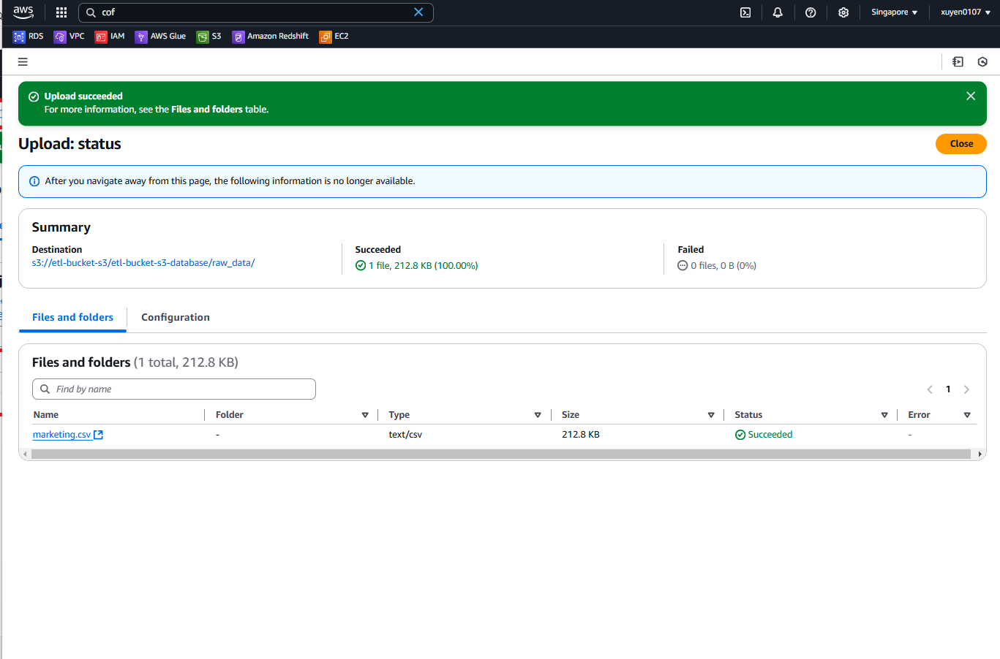
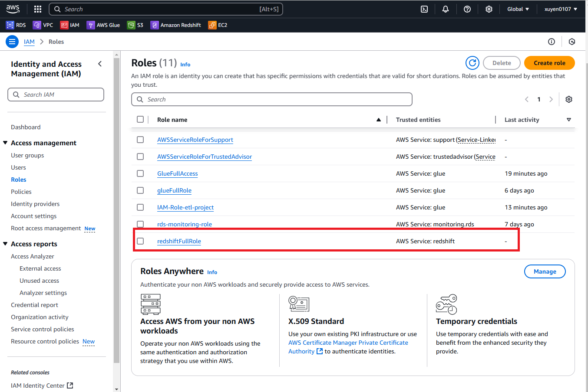

## Hello everyone. Welcome my Data Engineer (ETL) project. We will talk about ETL job using Apache Spark with AWS Glue.

# General model
<figure>
  
</figure>

## What we gonna do step by step
1. [Create IAM Role for whole project](#create-ıam-role-for-whole-project)
2. [Create an S3 bucket and load data to the bucket from our local](#create-an-s3)
3. [Create AWS Glue database and table](#create-aws-glue-database-and-table)
4. [Create Glue Studio Notebook](#create-glue-studio-notebook)
5. [Transform data using Spark](#transform-data-using-spark)
6. [Create AWS Redshift Cluster](#create-aws-redshift-cluster)
7. [Load the transformed data from S3 to Redshift](#load-the-transformed-data-from-s3-to-redshift)
# PART-1-EXTRACT
<figure>
  
</figure>
## 1.1  Firstly we should create an IAM Role for whole project.
Go to AWS IAM → Roles → Create Role

Use cases for other AWS services : Select Glue

Add permissions → Search and Select ‘AdministratorAccess’

Role name : ‘IAM-Role-etl-project’
<figure>
  
</figure>
<figure>
  
</figure>
<figure>
  
</figure>
<figure>
  
</figure>

## 1.2  We create a bucket in AWS S3.
Go to AWS S3 → Buckets → Create bucket

Bucket name: ‘etl-bucket-s3’
<figure>
  
</figure>

## 1.3 We create database folder.
AWS S3 → Buckets → ‘etl-bucket-s3’ → Create folder

Folder name: ‘etl-bucket-s3-database’

<figure>
  
</figure>

## 1.4 We create 2 folder for raw data and transformed data.
AWS S3 → Buckets → ‘etl-bucket-s3’ → ‘etl-bucket-s3-database’ → 2 x Create folder

Folder name : ‘raw_data’

Folder name : ‘transformed_data’


<figure>
  
</figure>

## 1.5 We upload our data from local to ‘raw_data’ bucket. You can get the data from this repo.
AWS S3 → Buckets → ‘etl-project-for-medium’ → ‘etl-project-for-medium-database’ → ‘raw_data’ → Upload → Add Files → ‘marketing.csv’

<figure>
  
</figure>
Okay, everything looks good in our bucket. Now, we should create Glue database and table. And load data to table from AWS S3.

## 1.6 we create a database.
Go to AWS Glue → Data Catalog → Databases → Add database

Database name: ‘etl-project-for-database’

Location: Copy S3 URI of ‘etl-project-for-database’ folder and paste it to location space.

<figure>
  
</figure>

## 1.7 We create a table in database we just created.
AWS Glue → Data Catalog → Databases → ‘etl-project-for-database’ → Add tables using crawler

Crawler name: ‘etl-project-for-medium-crawler’

Data source S3 path: Choose the ‘raw_data’ bucket

IAM role → Choose IAM role → ’IAM-Role-etl-project’

Target database → Choose the ‘etl-project-for-database’
<figure>
  
</figure>

## 1.8 Run the crawler.

<figure>
  
</figure>

## 1.9 Our crawler is successfully completed. Let’s check the table and schema of our table.
AWS Glue → Data Catalog → Databases → Tables → 'raw_data'
<figure>
  
</figure>
We just created our table. Check the data types of columns of data. Everything looks good in our table.

# PART-2-TRANSFORM
<figure>
  
</figure>

## 2.1 Firstly we create ETL Job in AWS Glue.

go to AWS Glue → Data Integration and ETL → ETL jobs → Notebooks

Job name: ‘etl-project-for-medium-job’

IAM Role → Choose the role that we created first episode of series → ‘’IAM-Role-etl-project’

Kernel : Spark
<figure>
  
</figure
  
## 2.2 Let’s write some PySpark code for transform the data. You can get the source "etl-project-transform-data.ipynb" file in this repo.

1. For set up and start your interactive session.
   ```
    %idle_timeout 2880
    %glue_version 3.0
    %worker_type G.1X
    %number_of_workers 5

    import sys
    from awsglue.transforms import *
    from awsglue.utils import getResolvedOptions
    from pyspark.context import SparkContext
    from awsglue.context import GlueContext
    from awsglue.job import Job

    sc = SparkContext.getOrCreate()
    glueContext = GlueContext(sc)
    spark = glueContext.spark_session
    job = Job(glueContext)
    ```
<figure>
  
</figure
2. Create a DynamicFrame from a table in the AWS Glue Data Catalog and display its schema.
    ```
    dyf = glueContext.create_dynamic_frame.from_catalog(database='etl-project-for-database', table_name='raw_data')
    dyf.printSchema()
    ```
3. Convert the DynamicFrame to a Spark DataFrame and display a sample of the data.
    ```
    df = dyf.toDF()
    df.show(10)
    ```
4. Drop columns that we don't need it.
    ```
    df = df["id","year_birth","education","marital_status","income","dt_customer"]
    df.show(10)
    ```
5. Check NaN values for each column.
    ```
    from pyspark.sql.functions import *
    df.select([count(when(col(c).isNull(),c)).alias(c) for c in df.columns]).show()
    ```
6. There are 24 NaN values in "income" column. Let's fill NaN values with mean.
    ```
    # Calculate the mean value of the column
    mean_value = df.select(mean(col('income'))).collect()[0][0]

    # Fill missing values with the mean value
    df = df.fillna(mean_value, subset=['income'])

    # Check
    df.select([count(when(col(c).isNull(),c)).alias(c) for c in df.columns]).show()
    ```
<figure>
  
</figure
7. Write the data to our S3 Bucket named "transformed_data" as csv.
    ```
  df.write \
      .format("csv") \
      .mode("append") \
      .option("header", "true") \
      .save("s3://etl-bucket-s3/etl-bucket-s3-database/transformed_data/")
    ```
8. Write the data to our S3 Bucket named "transformed_data" as json.
     ```
  df.write \
      .format("json") \
      .mode("append") \
      .save("s3://etl-project-for-medium/etl-project-for-medium-database/transformed_data/")
     ```
     
## 2.3 Let’s check our ‘transformed_bucket’.
<figure>
  
</figure

# PART-3-LOAD

<figure>
  
</figure
  
## 3.1 We should create another IAM Role for Redshift.
Go to AWS IAM → Roles → Create Role

Use cases for other AWS services : Select Redshift - Customizable

Add permissions → Search and Select 'AdministratorAccess'

Role name : 'IAM-Role-etl-project-redshift'
<figure>
  
</figure

## 3.2 Let's create AWS Redshift Cluster.


